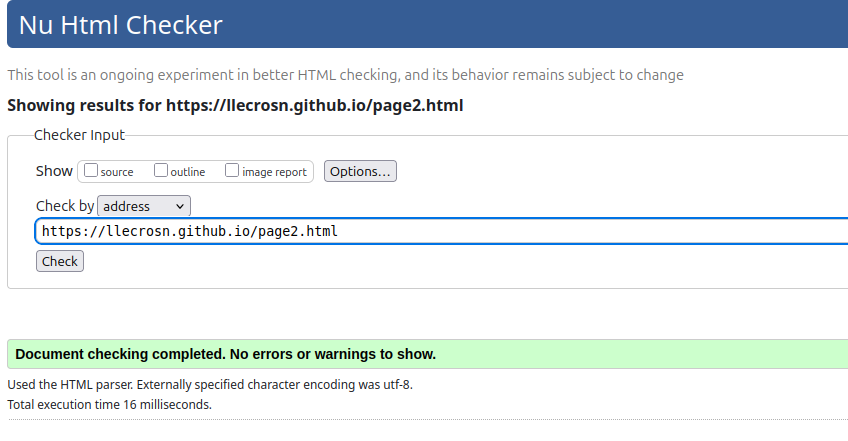
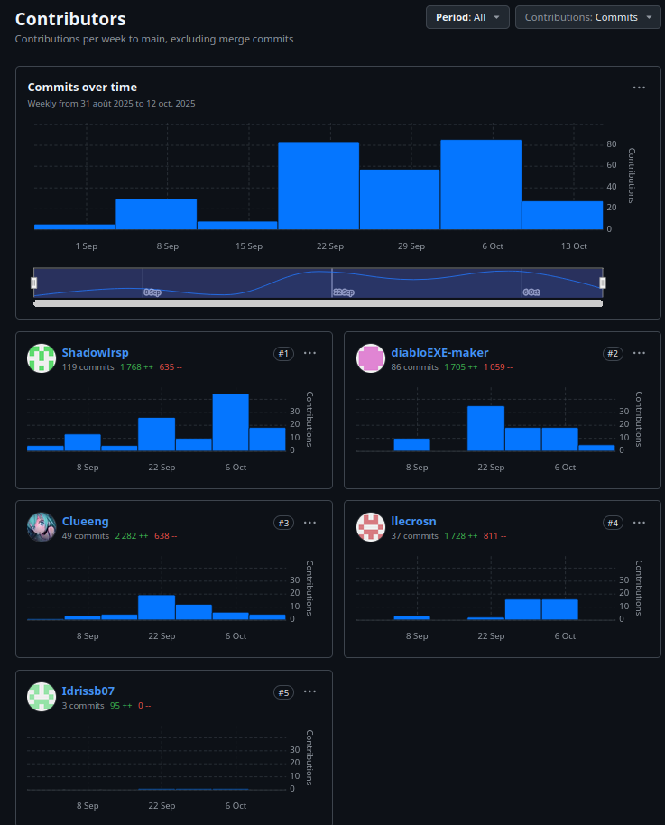

# Site SAE Groupe 10.
## Site Web
Page github: [cliquez ici](https://llecrosn.github.io/)
## Membres: Leo KRAKOVINSKY Brian LECOQ Landry LECROSNIER Mathis GOSSIAUX--CHOPARD-GUILLAUMOT Idrissa BARRY
[Leo KRAKOVINSKY](mailto:leo.krakovinsky@edu.univ-fcomte.fr?subject=SAE_1_05_06)
[Brian LECOQ](mailto:brian.lecoq@edu.univ-fcomte.fr?subject=SAE_1_05_06)
[Landry LECROSNIER](mailto:landry.lecrosnier@edu.univ-fcomte.fr?subject=SAE_1_05_06)
[Mathis GOSSIAUX--CHOPARD-GUILLAUMOT](mailto:mathis.gossiaux--chopard-guillaumot@edu.univ-fcomte.fr?subject=SAE_1_05_06)
[Idrissa BARRY](mailto:idrissa.barry@edu.univ-fcomte.fr?subject=SAE_1_05_06)

# Présentation du projet
Ce dépôt contient un site web en HTML/CSS réalisé dans le cadre de la SAÉ 05-06 à l'IUT NFC. Il présente **Scaleway**, son histoire depuis ses débuts jusqu’à son positionnement actuel comme fournisseur européen de solutions cloud. Le site met en avant ses services comme les machines virtuelles, le stockage et Kubernetes, et explique **les avantages économiques** pour les entreprises. Il souligne également les engagements de l’entreprise en matière de **sécurité, de souveraineté des données et de durabilité.** Des pages spécifiques détaillent son parcours, ses offres et les bonnes pratiques pour les développeurs et les entreprises. Enfin, le site propose des liens vers les ressources officielles et les contacts de l’entreprise.

## Choix de conception  

Pour la conception du site, nous nous sommes grandement inspirés du site officiel de Microbe Explorer (disponible [ici](https://microbexplorer.com/)) et nous avons pris comme référence la charte de Scaleway disponible [ici](doc/charte_graphique.pdf).

## Développement Site Web et Validation des pages

### Page d'accueil

**Auteur : Lecoq Brian et Gossiaux--chopard-guillaumot Mathis**  

Vérification W3C : [Détail ICI](https://validator.w3.org/nu/?doc=https%3A%2F%2Fllecrosn.github.io%2F)

### Présentation générale

**Auteur : Lecoq Brian**  

Verification W3C : [Détail ICI](https://validator.w3.org/nu/?doc=https%3A%2F%2Fllecrosn.github.io%2Fpage1.html)

**Auteur : Gossiaux--chopard-guillaumot Mathis**  

Verification W3C : [Détail ICI](https://validator.w3.org/nu/?doc=https%3A%2F%2Fllecrosn.github.io%2Fpage2.html)

**Auteur : Krakovinsky Leo**  

Verification W3C : [Détail ICI](https://validator.w3.org/nu/?doc=https%3A%2F%2Fllecrosn.github.io%2Fpage3.html)

**Auteur : Lecrosnier Landry**  

Verification W3C : [Détail ICI](https://validator.w3.org/nu/?doc=https%3A%2F%2Fllecrosn.github.io%2Fpage4.html)

**Auteur : Krakovinsky Leo**  

Verification W3C : [Détail ICI](https://validator.w3.org/nu/?doc=https%3A%2F%2Fllecrosn.github.io%2Fpage5.html)

**Auteur : Barry Idrissa**  
Verification W3C : [Détail ICI](https://)

## Répartition du travail

### Planification - Diagramme de GANTT

- Lecoq Brian

### Recherches d'informations
- Lecrosnier Landry
- Krakovinsky Leo

### Développement site

- Lecoq Brian
  - Page d’accueil
- Gossiaux--chopard-guillaumot Mathis
  - "Template" de page (Navbar/Footer)
- Lecoq Brian
  - Page histoire
- Gossiaux--chopard-guillaumot Mathis
  - Page économie
- Krakovinsky Leo
  - Page équipe
- Lecrosnier Landry
  - Page écologie
- Krakovinsky Leo
  - Page Clients
- Barry Idrissa
  - Page perspective

## Contributeurs

